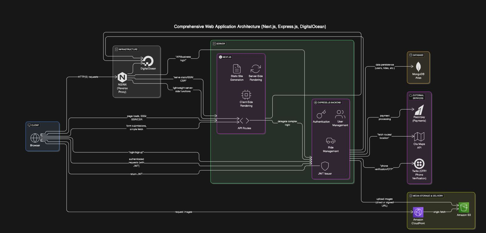
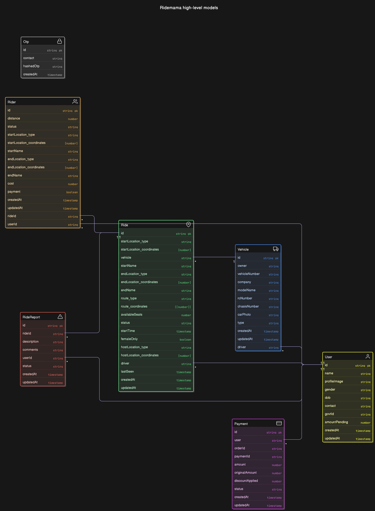
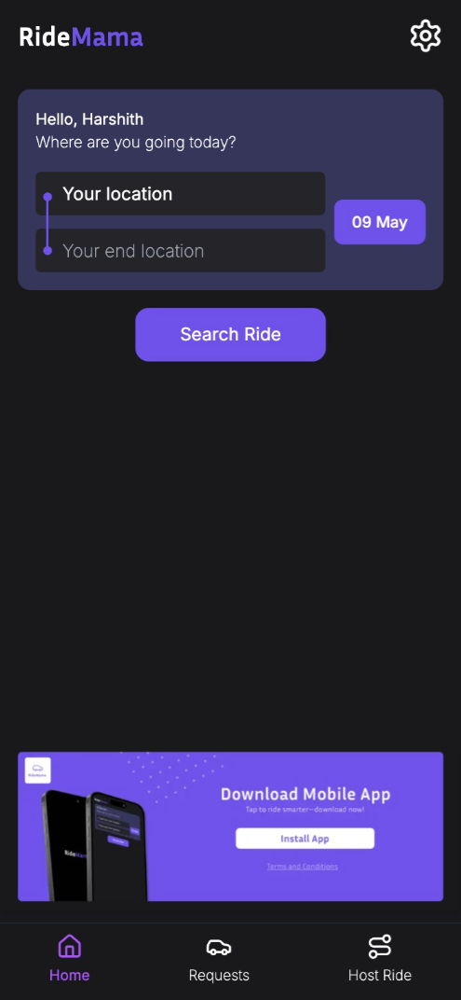
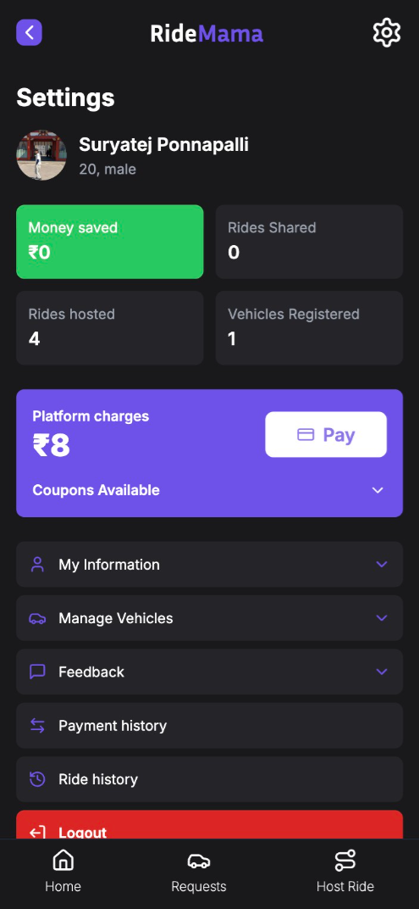
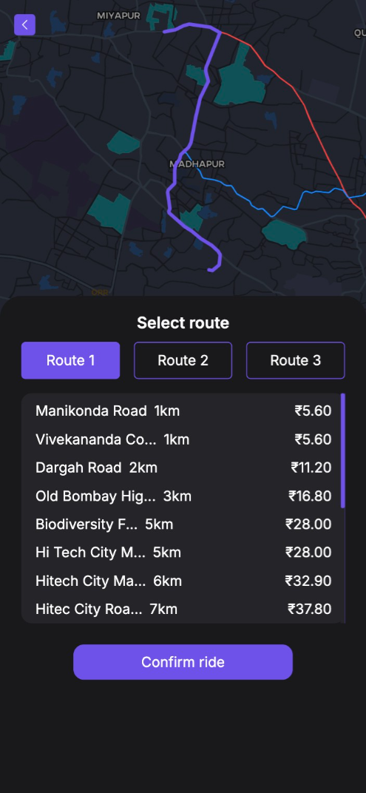
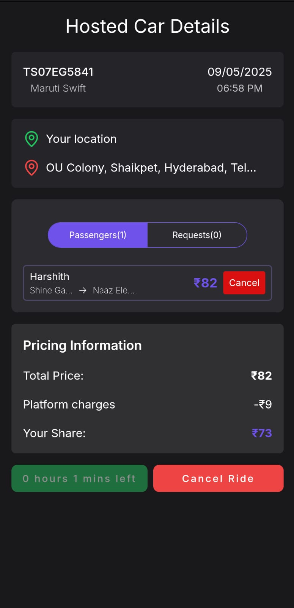
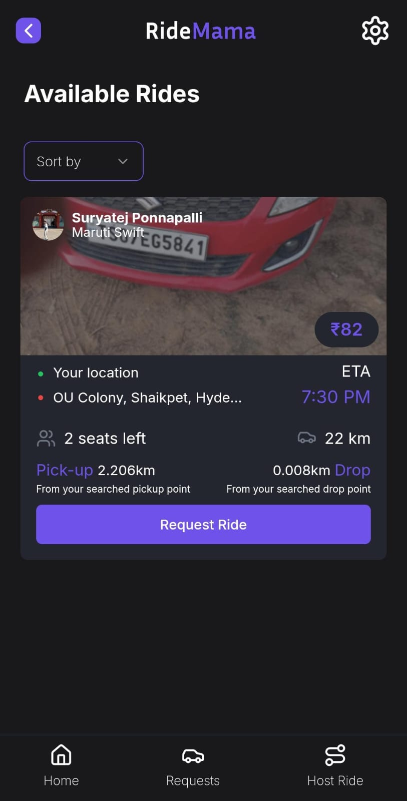
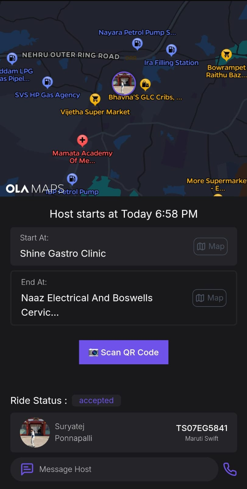
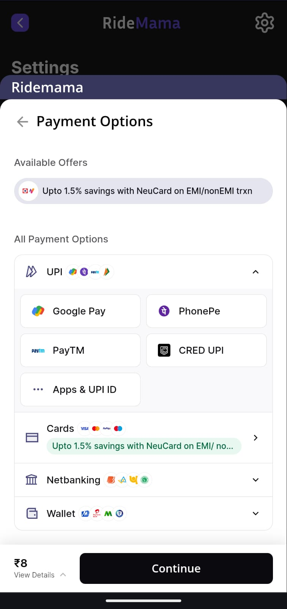

# RideMama

  
  
<em>Simplifying Campus Commutes - One Ride at a Time.</em>

Ridemama is a student-focused ride-sharing platform built to make daily commutes easier for students whose colleges are far from city centers. It aims to solve the challenges of finding instant rides, reducing daily bus struggles, and enabling smoother, more affordable transportation options.

## 📋 What is the Purpose of this Repository?

Since our codebase is private we thought of creating this repository that provides a technical walkthrough of the Ridemama platform, showcasing its architecture, design decisions, and engineering challenges without exposing code.

## 🚀 Key Features

- **Host your own car**: Share your ride with fellow students
- **Find rides at your preferred time**: Flexible scheduling that fits your timetable
- **Affordable, constant prices**: No surge pricing regardless of traffic conditions
- **Route selection flexibility**: Choose the best route for your journey
- **Direct payments**: Seamless transactions between riders and hosts
- **Simple, student-friendly interface**: Designed with campus commuters in mind

## 🏗️ System Architecture

High level system architecture of Ridemama

  

Our architecture follows a microservices approach with these key components:

- Frontend client application
- Backend API services
- Database layer
- Third-party integrations (Maps, Payments, Messaging)

## 🗂️ Database Schema

  

Our MongoDB schema includes these primary collections:

- Users (riders and hosts)
- Rides (scheduling, routing)
- Payments (transactions)
- Messages (in-app communication)
- Reviews (ratings and feedback)

## ⚙️ Tech Stack

| Component          | Technologies                          |
| ------------------ | ------------------------------------- |
| **Frontend**       | TypeScript, Next.js, Tailwind CSS     |
| **Backend**        | Node.js, Express.js                   |
| **Database**       | MongoDB (Atlas)                       |
| **Maps**           | Ola Maps by Krutrim                   |
| **Payments**       | Razorpay                              |
| **Messaging**      | Twilio WhatsApp Messaging             |
| **Authentication** | JWT                                   |
| **Hosting**        | DigitalOcean Droplets                 |
| **Image Storage**  | AWS S3                                |
| **Other Tools**    | Zod, Docker, GitHub Actions for CI/CD |

## 🚀 Future Improvements

| Feature                      | Priority | Notes                                     |
| ---------------------------- | -------- | ----------------------------------------- |
| WebSocket Integration        | High     | Real-time ride updates                    |
| TypeScript Backend Migration | Medium   | Better type safety and maintainability    |
| RC and DL API Integration    | High     | For automated vehicle verification        |
| Cross-Platform App           | Low      | Mobile-first approach                     |
| Bike Registration            | Low      | Pending insurance and regulatory approval |

## 📸 Screenshots and Visuals

  

    <h3>Home Screen</h3>
    
  

  
  

    <h3>Settings</h3>
    
  

  

    <h3>Host route Selection</h3>
    
  

  
  

    <h3>Host Dashboard</h3>
    
  

  

    <h3>Available rides</h3>
    
  

  
  

    <h3>Active rider page</h3>
    
  

  

    <h3>Payment Interface</h3>
    
  

## 🛠️ Challenges and Solutions

### Handling real-time updates

_Details to be added_

### Ensuring secure payments

_Details to be added_

### Optimizing ride matching algorithms

_Details to be added_

### Scaling the platform for peak traffic

_Details to be added_

## 📚 Lessons Learned

- **Importance of data consistency**: Maintaining accurate ride information across all system components
- **Balancing speed and security**: Implementing efficient authentication without compromising user experience
- **Managing real-time communication at scale**: Strategies for handling peak-time ride requests

## 👥 Contributors

  

    <a href="https://github.com/SuryatejPonnapalli">
      
      <h3 style="margin: 10px 0 5px 0; font-size: 18px; color: #6f52ea">Suryatej</h3>
    </a>
  

  
  

    <a href="https://github.com/harshith-1008">
      
      <h3 style="margin: 10px 0 5px 0; font-size: 18px; color: #6f52ea">Harshith</h3>
    </a>
  

  
  

    <a href="https://github.com/KDDhanush25">
      
      <h3 style="margin: 10px 0 5px 0; font-size: 18px; color: #6f52ea">Dhanush</h3>
    </a>
  

  
  

    <a href="https://github.com/BJVPavan">
      
      <h3 style="margin: 10px 0 5px 0; font-size: 18px; color: #6f52ea">Pavan</h3>
    </a>
  

## 📜 License

MIT License - See [LICENSE](LICENSE) file for details.

## 🔗 Links and References

- [Our First CI/CD Pipeline for Ridemama](https://www.saiharshith.in/blog/first-cicd-pipeline)

## 🌱 Stay Connected

Join the Ridemama journey and connect with us

  

    <a href="https://www.linkedin.com/company/ridemama/" target="_blank" style="text-decoration: none;">
      

        <svg xmlns="http://www.w3.org/2000/svg" width="24" height="24" viewBox="0 0 24 24" fill="white" style="margin-right: 8px;">
          <path d="M19 0h-14c-2.761 0-5 2.239-5 5v14c0 2.761 2.239 5 5 5h14c2.762 0 5-2.239 5-5v-14c0-2.761-2.238-5-5-5zm-11 19h-3v-11h3v11zm-1.5-12.268c-.966 0-1.75-.79-1.75-1.764s.784-1.764 1.75-1.764 1.75.79 1.75 1.764-.783 1.764-1.75 1.764zm13.5 12.268h-3v-5.604c0-3.368-4-3.113-4 0v5.604h-3v-11h3v1.765c1.396-2.586 7-2.777 7 2.476v6.759z"/>
        </svg>
        LinkedIn
      

    </a>
    <a href="https://www.instagram.com/ridemama_/" target="_blank" style="text-decoration: none;">
      

        <svg xmlns="http://www.w3.org/2000/svg" width="24" height="24" viewBox="0 0 24 24" fill="white" style="margin-right: 8px;">
          <path d="M12 2.163c3.204 0 3.584.012 4.85.07 3.252.148 4.771 1.691 4.919 4.919.058 1.265.069 1.645.069 4.849 0 3.205-.012 3.584-.069 4.849-.149 3.225-1.664 4.771-4.919 4.919-1.266.058-1.644.07-4.85.07-3.204 0-3.584-.012-4.849-.07-3.26-.149-4.771-1.699-4.919-4.92-.058-1.265-.07-1.644-.07-4.849 0-3.204.013-3.583.07-4.849.149-3.227 1.664-4.771 4.919-4.919 1.266-.057 1.645-.069 4.849-.069zm0-2.163c-3.259 0-3.667.014-4.947.072-4.358.2-6.78 2.618-6.98 6.98-.059 1.281-.073 1.689-.073 4.948 0 3.259.014 3.668.072 4.948.2 4.358 2.618 6.78 6.98 6.98 1.281.058 1.689.072 4.948.072 3.259 0 3.668-.014 4.948-.072 4.354-.2 6.782-2.618 6.979-6.98.059-1.28.073-1.689.073-4.948 0-3.259-.014-3.667-.072-4.947-.196-4.354-2.617-6.78-6.979-6.98-1.281-.059-1.69-.073-4.949-.073zm0 5.838c-3.403 0-6.162 2.759-6.162 6.162s2.759 6.163 6.162 6.163 6.162-2.759 6.162-6.163c0-3.403-2.759-6.162-6.162-6.162zm0 10.162c-2.209 0-4-1.79-4-4 0-2.209 1.791-4 4-4s4 1.791 4 4c0 2.21-1.791 4-4 4zm6.406-11.845c-.796 0-1.441.645-1.441 1.44s.645 1.44 1.441 1.44c.795 0 1.439-.645 1.439-1.44s-.644-1.44-1.439-1.44z"/>
        </svg>
        Instagram
      

    </a>
    <!-- <a href="https://twitter.com/ridemama" target="_blank" style="text-decoration: none;">
      

        <svg xmlns="http://www.w3.org/2000/svg" width="24" height="24" viewBox="0 0 24 24" fill="white" style="margin-right: 8px;">
          <path d="M24 4.557c-.883.392-1.832.656-2.828.775 1.017-.609 1.798-1.574 2.165-2.724-.951.564-2.005.974-3.127 1.195-.897-.957-2.178-1.555-3.594-1.555-3.179 0-5.515 2.966-4.797 6.045-4.091-.205-7.719-2.165-10.148-5.144-1.29 2.213-.669 5.108 1.523 6.574-.806-.026-1.566-.247-2.229-.616-.054 2.281 1.581 4.415 3.949 4.89-.693.188-1.452.232-2.224.084.626 1.956 2.444 3.379 4.6 3.419-2.07 1.623-4.678 2.348-7.29 2.04 2.179 1.397 4.768 2.212 7.548 2.212 9.142 0 14.307-7.721 13.995-14.646.962-.695 1.797-1.562 2.457-2.549z"/>
        </svg>
        Twitter
      

    </a> -->
  

Follow the journey as we continue to improve Ridemama and expand its reach.

---
